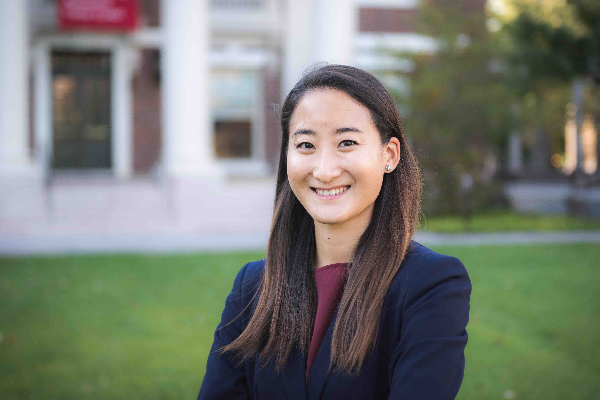

<link rel="stylesheet" href=https://cdn.rawgit.com/jpswalsh/academicons/master/css/academicons.min.css type="text/css">

\  

I am a Research Scientist at the [Boston Dynamics AI Institute](https://theaiinstitute.com/). 

My research studies the impact of policies and technologies aimed to improve society. I have expertise in experimental and quasi-experimental methods, survey design, and data visualization. I previously worked at Amazon and the World Bank. I hold a Ph.D. from Harvard University, where I was a [NAEd/Spencer Dissertation Fellow](https://naeducation.org/2021-naed-spencer-dissertation-fellows/) and a Ph.D. Scholar in the [Multidisciplinary Program in Inequality & Social Policy](https://inequality.hks.harvard.edu/people/nozomi-nakajima). 

